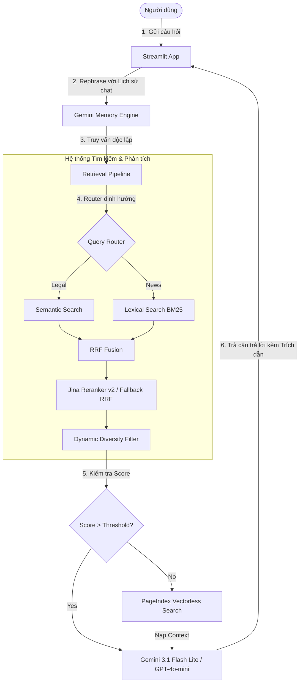

# Group C2-C401 — RAG Pipeline & Evaluation Chatbot

Dự án này là sản phẩm bài tập nhóm Lab 8, xây dựng hệ thống **RAG Chatbot** và **Evaluation Pipeline** tích hợp đầy đủ công nghệ Hybrid Search, Reranking, bộ lọc đa dạng hóa nguồn tin (Dynamic Source Diversification), và cơ chế Fallback sang PageIndex (Vectorless RAG).

---

## 🏗️ Kiến Trúc Hệ Thống

Dưới đây là sơ đồ luồng xử lý thông tin từ đầu cuối (End-to-End) của RAG Pipeline:



---

## 👥 Phân Phối Nhiệm Vụ Thành Viên

| Thành viên | MSSV | Nhiệm vụ chính trong dự án | Trạng thái |
|---|---|---|---|
| **Trần Hoàng Đạt** | `2A202600807` | Project Lead, Thiết kế luồng định tuyến (Query Routing), Hybrid Search, dynamic diversity filters, lost-in-the-middle reordering, và cơ chế Fallback PageIndex. | **Completed** |
| **Nguyễn Văn Đoan** | `2A202600795` | Phụ trách thu thập, tiền xử lý và chuyển đổi định dạng tài liệu gốc (.docx) sang chuẩn hóa Markdown (`markitdown`). | **Completed** |
| **Lê Duy Hùng** | `2A202600718` | Xây dựng Module tìm kiếm Lexical Search (BM25) và tối ưu hóa việc phân tách từ (Tokenization) tiếng Việt. | **Completed** |
| **Phạm Thị Tuyết Nga** | `2A202600877` | Thiết lập Vector Store (ChromaDB) và chạy thử nghiệm cấu hình Chunking đệ quy (`RecursiveCharacterTextSplitter`). | **Completed** |
| **Tạ Duy Xuân** | `2A202600970` | Phát triển giao diện Streamlit Chatbot, tích hợp quản lý bộ nhớ lịch sử trò chuyện (Conversation Memory) và hiển thị trích dẫn nguồn. | **Completed** |

---

## 🚀 Hướng Dẫn Cài Đặt & Chạy Ứng Dụng

### 1. Chuẩn bị môi trường và API Keys
Tạo file `.env` tại thư mục gốc dự án (nếu chưa có) và bổ sung các khóa API cần thiết:
```bash
GEMINI_API_KEY=AIzaSyAvj_...
PAGEINDEX_API_KEY=pi_...
JINA_API_KEY=jina_...
```

### 2. Cài đặt các thư viện cần thiết
```bash
pip install -r requirements.txt
pip install deepeval
```

### 3. Chạy ứng dụng Chatbot giao diện Streamlit
Chạy lệnh sau từ thư mục gốc của repository:
```bash
streamlit run group_project/app.py
```

### 4. Chạy kiểm thử chất lượng RAG (Evaluation Pipeline)
Chạy script kiểm thử chất lượng A/B Testing bằng DeepEval:
```bash
python group_project/evaluation/eval_pipeline.py
```
Sau khi chạy xong, kết quả đánh giá chi tiết sẽ tự động được ghi nhận tại file `group_project/evaluation/results.md` và hiển thị trực tiếp trên tab **Bảng điểm Evaluation** của giao diện Streamlit.
