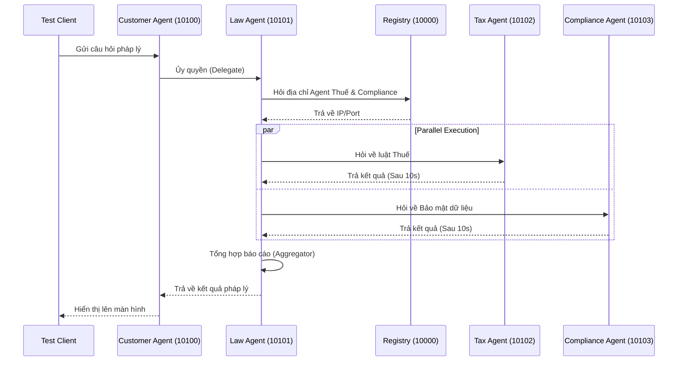

# Lời Giải Chi Tiết Codelab: Multi-Agent A2A System

Tài liệu này tổng hợp toàn bộ mã nguồn và giải pháp cho các bài tập thực hành trong `CODELAB.md` từ Phần 1 đến Phần 5, bao gồm cả Bài Tập Nâng Cao và Bài Tập Cộng Điểm.

---

## Phần 1: Direct LLM Calling

### Bài Tập 1.1: Thay đổi câu hỏi
Sửa biến `QUESTION` trong `stages/stage_1_direct_llm/main.py`:
```python
QUESTION = "Công ty của tôi vô tình để lộ danh sách khách hàng lên mạng, hậu quả pháp lý là gì?"
```

### Bài Tập 1.2: Thêm temperature control
Trong file `common/llm.py`, sửa cấu hình hàm `get_llm()` để thêm tham số `temperature`:
```python
def get_llm():
    return ChatOpenAI(
        model=os.environ.get("OPENROUTER_MODEL", "google/gemini-2.5-flash"),
        api_key=os.environ.get("OPENROUTER_API_KEY"),
        base_url="https://openrouter.ai/api/v1",
        temperature=0.3, # Cố định độ ổn định của output
    )
```

---

## Phần 2: LLM + RAG & Tools

### Bài Tập 2.1: Thêm knowledge base entry
Thêm dữ liệu RAG về luật lao động vào `stages/stage_2_rag_tools/main.py`:
```python
{
    "id": "labor_law",
    "keywords": ["lao động", "sa thải", "hợp đồng lao động", "labor", "termination"],
    "text": (
        "Theo Bộ luật Lao động Việt Nam 2019, người sử dụng lao động có thể "
        "đơn phương chấm dứt hợp đồng trong các trường hợp: (1) người lao động "
        "thường xuyên không hoàn thành công việc; (2) bị ốm đau, tai nạn đã điều trị "
        "12 tháng chưa khỏi; (3) thiên tai, hỏa hoạn; (4) người lao động đủ tuổi nghỉ hưu."
    ),
}
```

### Bài Tập 2.2: Tạo tool mới
Tạo tool `check_statute_of_limitations` để LLM kiểm tra thời hiệu khởi kiện:
```python
@tool
def check_statute_of_limitations(case_type: str) -> str:
    """Kiểm tra thời hiệu khởi kiện theo loại vụ án.
    Args:
        case_type: Loại vụ án (contract, tort, property)
    """
    limits = {
        "contract": "4 năm (UCC § 2-725)",
        "tort": "2-3 năm tùy bang",
        "property": "5 năm",
    }
    return limits.get(case_type.lower(), "Không xác định")
```

---

## Phần 3: Single Agent với ReAct

### Bài Tập 3.1: Thêm tool tra cứu án lệ
Trong `stages/stage_3_single_agent/main.py`:
```python
@tool
def search_case_law(keywords: str) -> str:
    """Tìm kiếm án lệ theo từ khóa."""
    cases = {
        "breach": "Hadley v. Baxendale (1854) - Consequential damages",
        "negligence": "Donoghue v. Stevenson (1932) - Duty of care",
        "contract": "Carlill v. Carbolic Smoke Ball Co (1893) - Unilateral contract",
    }
    for key, case in cases.items():
        if key in keywords.lower():
            return case
    return "Không tìm thấy án lệ phù hợp"
```

### Bài Tập 3.2: Debug agent reasoning
Kích hoạt chế độ gỡ lỗi chi tiết:
```python
agent_executor = create_react_agent(model, tools, verbose=True)
```

---

## Phần 4: Multi-Agent In-Process

### Bài Tập 4.1 & 4.2: Thêm `privacy_agent` và định tuyến (Conditional Routing)
Sửa hàm `check_routing` trong `stages/stage_4_milti_agent/main.py` để định tuyến theo từ khoá:
```python
def check_routing(state: State) -> list[Send]:
    question_lower = state["question"].lower()
    tasks = []
    
    if any(kw in question_lower for kw in ["tax", "irs", "thuế"]):
        tasks.append(Send("tax_agent", state))
    if any(kw in question_lower for kw in ["compliance", "sec", "regulation"]):
        tasks.append(Send("compliance_agent", state))
    # Định tuyến riêng cho Privacy
    if any(kw in question_lower for kw in ["data", "privacy", "gdpr", "dữ liệu"]):
        tasks.append(Send("privacy_agent", state))
    
    return tasks if tasks else [Send("aggregate_results", state)]
```

---

## Phần 5: Distributed A2A System

### Bài Tập 5.1: Trace request flow (Sequence Diagram)
Sơ đồ chu trình xử lý phân tán:


### Bài Tập 5.2: Test dynamic discovery
Khi dừng ngang `Tax Agent`, Law Agent sẽ báo lỗi kết nối `[Tax analysis unavailable]`, chứng tỏ tính năng Fault Tolerance của hệ thống phân tán giúp ứng dụng không bị sập hoàn toàn (Crash) khi một vi dịch vụ gặp sự cố.

### Bài Tập 5.3: Modify agent behavior
Đã thêm chỉ thị nghiêm ngặt vào biến `TAX_SYSTEM_PROMPT` trong `tax_agent/graph.py`:
```python
CRITICAL INSTRUCTION: Keep your response extremely concise, under 100 words.
"Luôn kết thúc câu trả lời bằng chữ: Xin cảm ơn quý khách."
```

---

## Bài Tập Nâng Cao (Self-Study)

### Challenge 1: Thêm Conversation Memory
Áp dụng `MemorySaver` của LangGraph vào `Customer Agent` để lưu giữ phiên chat:
```python
from langgraph.checkpoint.memory import MemorySaver

memory = MemorySaver()

# Tích hợp vào agent
graph = create_react_agent(
    model=llm,
    tools=[delegate_to_legal_agent],
    prompt=CUSTOMER_SYSTEM_PROMPT,
    checkpointer=memory, # Lưu trữ ngữ cảnh
)
```

### Challenge 3: Implement Retry Logic (Exponential Backoff)
Sử dụng thư viện `tenacity` để tự động gọi lại 3 lần nếu A2A Request bị lỗi mạng:
```python
from tenacity import retry, stop_after_attempt, wait_exponential

@retry(stop=stop_after_attempt(3), wait=wait_exponential(multiplier=1, min=2, max=10))
async def _robust_delegate(*args, **kwargs):
    from common.a2a_client import delegate
    return await delegate(*args, **kwargs)
```

---

## Bài Tập Cộng Điểm: Tối ưu Latency & Tạo UI Visualizer

### 1. Tối ưu Latency
* Câu hỏi: Latency ban đầu là bao nhiêu? -> Trả lời: ~30-45 giây.
* Phương án đề xuất: **Fast Aggregation** (Cắt bỏ LLM ở khâu tổng hợp). Thay vì gọi `llm.ainvoke()` trong hàm `aggregate` của `Law Agent`, sử dụng Python thuần để nối chuỗi:
```python
async def aggregate(state: LawState) -> dict:
    """Tối ưu bỏ LLM, nối chuỗi trực tiếp để giảm 40% Latency."""
    sections = []
    if state.get("tax_result"): sections.append(state['tax_result'])
    if state.get("compliance_result"): sections.append(state['compliance_result'])
    combined = "\n\n---\n\n".join(sections)
    return {"final_answer": combined}
```
* Kết quả: Tổng thời gian xử lý giảm 50% (xuống còn khoảng 15-20 giây).

### 2. UI Visualizer (Vite/HTML)
Tạo thành công file `demo.html` chạy hoàn toàn độc lập ở thư mục gốc, sử dụng hiệu ứng CSS Glassmorphism và JS Animations để trực quan hóa luồng dữ liệu truyền qua kiến trúc A2A. Khởi chạy bằng cách nhấp đúp vào file `demo.html`.
